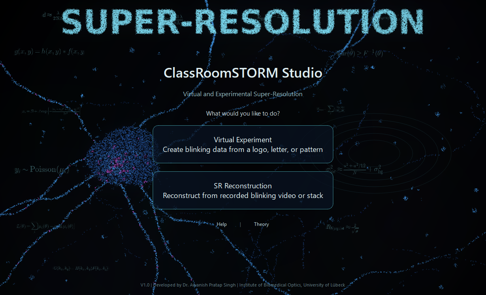

# ClassRoomSTORM Studio V1.2

Current patch version: **1.2.1**. The application and manuals use the V1.2 series name.

[](https://github.com/awanishsingh009/ClassRoomSTORM/actions/workflows/tests.yml)
[](LICENSE)

**Download v1.2.1:** [Windows ZIP](https://github.com/awanishsingh009/ClassRoomSTORM/releases/download/v1.2.1/ClassRoomSTORM-1.2.1-windows.zip) | [macOS ZIP](https://github.com/awanishsingh009/ClassRoomSTORM/releases/download/v1.2.1/ClassRoomSTORM-1.2.1-macos.zip) | [Source ZIP](https://github.com/awanishsingh009/ClassRoomSTORM/releases/download/v1.2.1/ClassRoomSTORM-1.2.1-source.zip)

Students: choose your Windows or macOS package, extract the ZIP, run setup once, then open the launcher. [See installation steps and all downloads below.](#downloads)

ClassRoomSTORM is a cross-platform Python teaching toolkit for stochastic blinking, localization microscopy, and super-resolution reconstruction. It connects an interactive virtual experiment with an independent video-reconstruction workflow so students can explore how blinking statistics, noise, emitter density, and localization create a reconstructed image.



## Workflows

- **Virtual Experiment:** generate a blinking MP4 from text, dots, or a logo with configurable point-spread width, photon count, background, read noise, emitter density, and spacing.
- **SR Reconstruction:** inspect and crop real or simulated videos, localize single or multiple bright regions, render a reconstruction, and export quantitative and teaching outputs.
- **Truth-based validation:** compare reconstructed localizations with simulation truth only after reconstruction. Truth coordinates are never used by the reconstruction algorithm.
- **Teaching reports:** export figures, localization tables, JSON metadata, pipeline reports, and linked line-profile visualizations.
- **Processing backends:** use serial or parallel CPU processing, with optional experimental NVIDIA CUDA acceleration and documented CPU fallback.

## Scope

ClassRoomSTORM is deliberately transparent educational software. The V1.2 reconstruction uses percentile thresholding, connected components for multiple emitters, and intensity-weighted centroid localization. It does not replace research-grade SMLM packages with Gaussian/MLE fitting, drift correction, uncertainty estimation, or camera-specific calibration.

## Run from source

Python 3.11 is recommended. Python 3.10-3.13 is supported.

```bash
python -m venv .venv
.venv/Scripts/python -m pip install -r requirements.txt  # Windows
.venv/Scripts/python apps/ClassRoomSTORM_Studio.py
```

On macOS or Linux, use `.venv/bin/python` in place of `.venv/Scripts/python`. The commands above explicitly use the project environment; activation is optional.

The `packaging/windows` and `packaging/macos` folders contain setup and launch scripts used to build the user packages.

## Command-Line Example

Generate a virtual ABBE experiment:

```bash
python apps/ClassRoomSTORM_VirtualExperiment.py \
  --generate-demo --pattern text --text ABBE --frames 100 \
  --out results/virtual_experiments/ABBE_demo
```

Reconstruct the generated video and compare with truth afterward:

```bash
python apps/ClassRoomSTORM_Reconstruction.py \
  --run-video results/virtual_experiments/ABBE_demo/blinking_video.mp4 \
  --out results/reconstructions/ABBE_demo --blinker-mode auto --compare-truth
```

## Outputs

Virtual experiments produce `blinking_video.mp4`, `truth.csv`, `metadata.json`, `preview_frame.png`, and `pattern_mask.png`.

Reconstructions produce `localizations.csv`, `summary.json`, NumPy arrays, rendered PNGs, diagnostic plots, and HTML/Markdown/SVG pipeline reports.

## Documentation

- [User Help](docs/ClassRoomSTORM_Help.pdf): installation, controls, workflows, outputs, and troubleshooting.
- [Theory Notes](docs/ClassRoomSTORM_Theory.pdf): diffraction, PSFs, blinking, noise, centroid localization, precision, and limitations.
- [User Guide](docs/ClassRoomSTORM_User_Guide.md): concise installation and workflow reference.
- [Technical Notes](docs/ClassRoomSTORM_Technical_Notes.md): algorithm, backend, and design scope.

## Tests

```bash
python -m pip install -r requirements-dev.txt
python -m pytest -q
```

The test suite covers simulation, reconstruction, CPU/GPU fallback behavior, frame-aware truth comparison, plots, reports, result catalogs, and the Studio launcher.

## Author

Dr. Awanish Pratap Singh<br>
Institute of Biomedical Optics, University of Lübeck

## Citation And License

Citation metadata is provided in [`CITATION.cff`](CITATION.cff). ClassRoomSTORM is released under the [MIT License](LICENSE).

## V1.2 quantitative output and release workflow

Calibration: add `--pixel-size 0.25 --unit mm` to export physical coordinates. Pixel columns are retained; physical coordinates use the original frame origin. Images remain in pixel units. `--background-mode frame_median` optionally subtracts the cropped-frame median.

Truth comparison uses one-to-one same-frame matching with `--truth-radius-px 2`, and reports precision, recall, F1 and matched errors only within the processed crop/frame range. Rendering preserves fractional positions but does not measure optical resolution. Choose an empty output folder; existing results are protected.

Build manuals with `python tools/build_docs.py`. Refresh adjacent Windows and macOS packages with `python tools/build_user_packages.py`; previous packages and their results move to `../archive/user_packages/`. Verify shipped hashes and equality to the current source with `python tools/build_user_packages.py --validate`.

For a future GitHub update, follow [the release instructions](docs/RELEASE.md). `python tools/prepare_github_release.py --output ../releases/ClassRoomSTORM-1.2.1-ready` creates a clean source folder and separate source/Windows/macOS ZIPs with checksums. It does not commit or publish anything.

## Revised scientific figures

The physics-reviewed figure sources, fixed-seed data and build instructions are in [docs/figures_src/README.md](docs/figures_src/README.md). Review all scientific masters in [Scientific_Figure_Review.pdf](docs/Scientific_Figure_Review.pdf). The manuals and manuscript use these shared masters; historical artwork is preserved.

## Downloads

Choose one of these three **v1.2.1** downloads. Windows and macOS packages include the setup scripts, launcher, sample data, and Help and Theory PDFs.

| Package | Direct download | After extracting the ZIP |
| --- | --- | --- |
| **Windows** | **[Download Windows ZIP](https://github.com/awanishsingh009/ClassRoomSTORM/releases/download/v1.2.1/ClassRoomSTORM-1.2.1-windows.zip)** | Open `ClassRoomSTORM_V1_User_windows`, run `setup_windows.bat` once, then use `launch_studio_windows.bat`. |
| **macOS** | **[Download macOS ZIP](https://github.com/awanishsingh009/ClassRoomSTORM/releases/download/v1.2.1/ClassRoomSTORM-1.2.1-macos.zip)** | Open `ClassRoomSTORM_V1_User_macos`, run `setup_macos.command` once, then use `launch_studio_macos.command`. |
| **Source** | **[Download source ZIP](https://github.com/awanishsingh009/ClassRoomSTORM/releases/download/v1.2.1/ClassRoomSTORM-1.2.1-source.zip)** | Open `ClassRoomSTORM_Source` and follow [Run from source](#run-from-source). Includes code, tests, and editable documentation and figures. |

### First installation

1. Download your package and extract the whole ZIP to a folder you can write to. Keep its files together.
2. Use Python 3.11, 3.12, or 3.13; Python 3.11 is the version tested for this release. Windows setup offers to install Python if it is missing. On macOS, install Python before running setup.
3. Run the setup file listed above while connected to the internet and wait for **"Setup completed"**. If Windows setup installs Python, run setup again afterward. Compatible local wheels can be used for offline installation as described in `README_FIRST.txt`.
4. Open the launcher. On later visits, use the launcher directly. Complete this first installation before the practical session.

If you downloaded **Code > Download ZIP**, you have the repository source. Use the **Windows** or **macOS** links above to get the student package with setup and launch files in its main folder. For platform-specific help, open `README_FIRST.txt` in the extracted package.

[Release notes and all assets](https://github.com/awanishsingh009/ClassRoomSTORM/releases/tag/v1.2.1) | [SHA-256 checksums](https://github.com/awanishsingh009/ClassRoomSTORM/releases/download/v1.2.1/SHA256SUMS.txt)
